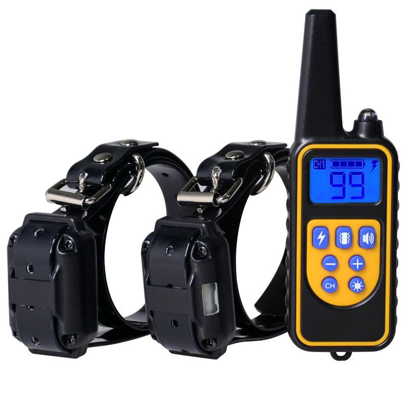
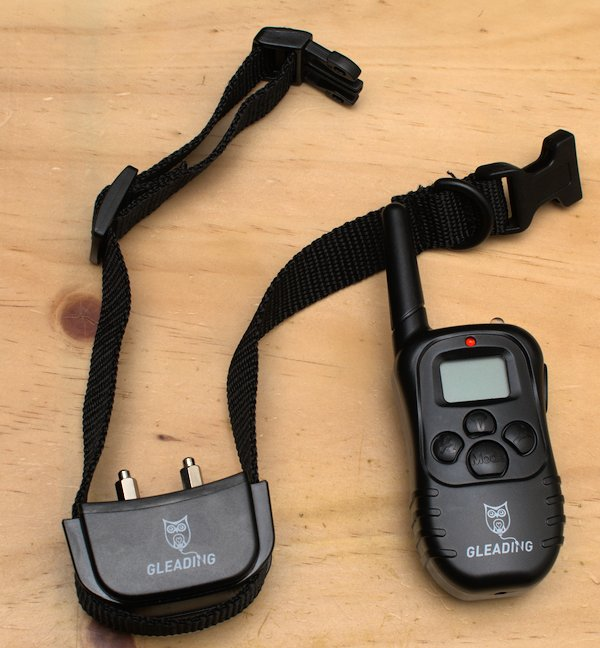

Collar
=====
This is an Arduino library to control (currently) two types of shock collar which are easy to find at the moment on ebay. Because they seem to go by different names, I'm just going to unimaginatively call them TypeX:

### Type 1

For more details, see [Type1](extra/Type1.MD).

### Type 2

For more details, see [Type2](extra/Type2.MD).

### Others
* There are also other libraries which can control other similar shock collars, e.g. [DogCollar2](https://github.com/flash89y/Arduino/tree/master/libraries/DogCollar2)

* Also see https://ripper121.com/dogs-education-collar-433-mhz-arduino-pilight/ for details of another collar type

## Hardware
The only required hardware is an Arduino (tested on an Uno) and a 433MHz transmitter and/or receiver module which can be obtained cheaply from ebay.
The TX module can be used on any digital pin, but the RX module must be connected to either digital 2 or 3, as these have interrupts.

## Installation
Similar to pretty much any other Arduino library... either:
1. Put the contents of `collar` directory of the repo into the Arduino/sketchbook libraries folder, or
2. Download a zip of this repo, and use the "Sketch -> Include Library -> Add .ZIP Library" option from the IDE

## Examples
All examples can be used with both types of collar, just change the single reference from Type1 to Type2 as needed (examples have a comment above the line that needs changing).

* ColRxExample - this will output to the serial console any messages received, including the ID of the transmitter - which can be used to clone the original transmitter, rather than needing to re-pair the collars.
I should probably point out that whilst the CollarTx library seems pretty reliable so far, the CollarRx library is not so great, and isn't particularity well written. But unless you want to use the original controller, it shouldn't really matter.

* ColTxSimple - about the simplest example possible that controls a collar - it sends a vibrate command with power=10 for channel 1. If the ID of the original collar is known (e.g. from the Rx example), it can be entered, otherwise an ID should be made up, and the collars paired following the usual process.

* ColTxSerial - allows all message types (shock/vibrate/beep ch1/2/3 with power level) to be transmitted using input from the serial console. It outputs instructions on the serial console on startup.

